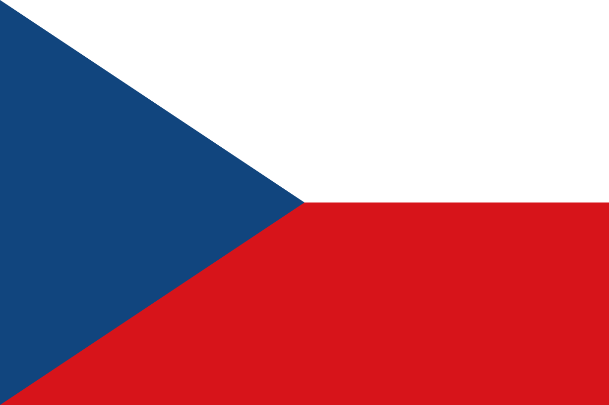

# Curso Básico de Checo

¡Bienvenido al Curso Básico de Checo!

Este curso está diseñado para ayudarte a dar tus primeros pasos en el aprendizaje del idioma checo, ya sea por interés personal, viajes o cualquier otra razón. A lo largo de este curso, exploraremos los fundamentos del checo, incluyendo vocabulario esencial, gramática básica y frases útiles para la comunicación cotidiana.

## Índice

+ [Tema 1: Pronunciación](01-pronunciacion/README.md)
+ [Tema 2: Vocabulario](02-vocabulario/README.md)
+ [Tema 3: Gramática](03-gramatica/README.md)

## ¿Por qué aprender checo?

El checo es un idioma eslavo occidental hablado por más de 10 millones de personas, principalmente en la República Checa. Aprender checo no solo te permite sumergirte en la fascinante cultura checa, sino que también puede abrirte puertas en términos de oportunidades laborales, educativas y de viaje en la región.

## Estructura del Curso

El curso está dividido en varias lecciones, cada una centrada en un tema específico del idioma checo. Comenzaremos con lo básico, como saludos y presentaciones, y avanzaremos gradualmente hacia temas más complejos a medida que avances en tu aprendizaje.

## Requisitos Previos

No se requiere experiencia previa en checo para este curso. Solo necesitas entusiasmo, dedicación y disposición para aprender.

## Formato del Curso

Las lecciones estarán principalmente en formato de texto, utilizando Markdown para una fácil lectura y navegación. También proporcionaremos ejemplos de pronunciación y, ocasionalmente, material multimedia para reforzar el aprendizaje.

## ¿Estás listo para comenzar?

¡Empecemos nuestro viaje de aprendizaje del checo juntos! No dudes en hacer preguntas, participar en discusiones y practicar tanto como puedas. ¡Buena suerte y disfruta del curso!

